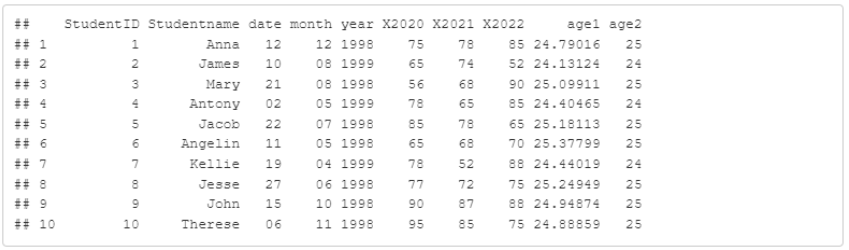
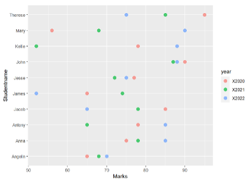
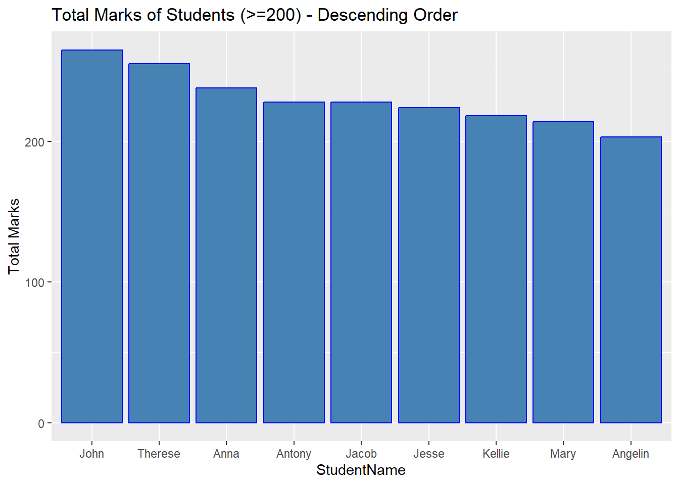

Student ID  : 22114129 <br>
Student Name: Sandip Subedi

```{r setup, include=FALSE}
knitr::opts_chunk$set(echo = TRUE)
```

Get your current working directory in R using **getwd ()** function

```{r}
dir=getwd()
```

Set your working  directory in R using **setwd ()** function


```{r}
setwd(dir)
```

```{r}
#DO NOT CHANGE THE CODE BELOW!
word_count <- function(s)
  {
    return(length(strsplit(str, "\\s+")[[1]]))
  }
```

## Task 1
[ChatGPT url](https://chatgpt.com/share/xxxxxxxx)


**Without the valid link, your Task1 will be marked <50%**

Task 1.a <br>

```{r}
#Put your R code to produce the correct dataframe here

# load CSV into  data frame
df <- read.csv("Studentmarks.csv")

# Checking the structure of the dataframe df
str(df)

# Converting the dob column into a date object
df$dob <- as.Date(df$dob, format = "%d/%m/%Y")  # Adjust the format as needed

# Checking the structure of the dataframe again to confirm the conversion
str(df)

# Calculate the current age from the dob column and store it in a new column 'age1'
df$age1 <- round(as.numeric(difftime(Sys.Date(), df$dob, units = "days")) / 365.25, 5)

# View the updated dataframe
head(df)

# Extract day, month, and year from the dob column into separate columns
df$day <- as.integer(format(df$dob, "%d"))  # Extract day
df$month <- as.integer(format(df$dob, "%m"))  # Extract month
df$year <- as.integer(format(df$dob, "%Y"))  # Extract year

# View the updated dataframe
head(df)

#Extracting the current year 
current_year <- as.integer(format(Sys.Date(), "%Y"))

#Calculate age using year only and store it in a new column 'age2'
df$age2 <- current_year - df$year

#updated dataframe
print(df)

#drop dob column
df$dob <- NULL

#view updated df
print(df)

#change name of column 'day'to 'date'
colnames(df)[which(names(df) == "day")] <- "date"

#view updated df
print(df)

#reorder the columns
df <- df[, c("StudentID","Studentname","date","month","year","X2020","X2021","X2022","age1","age2")]

#view updated df
print(df)

#
```

```{r}
#Use your own words to explain how the code works.
str<-"Your logical Explanation for 1.a"
print(paste("Word Count: ",word_count(str)))
```

Task 1.b

```{r}
#Put your R code to produce the correct chart here
# Load ggplot2 library
library(ggplot2)

# Create scatter plot with labels and color legend title
ggplot(df) +
  geom_point(aes(x = X2020, y = Studentname, color = "X2020")) +
  geom_point(aes(x = X2021, y = Studentname, color = "X2021")) +
  geom_point(aes(x = X2022, y = Studentname, color = "X2022")) +
  labs(x = "Marks", y = "Studentname", color = "Year")

```

```{r}
#Use your own words to explain how the code works.
str<-"Your logical Explanation for 1.b"
print(paste("Word Count: ",word_count(str)))
```

Task 1.c

```{r}
#Put your R code to produce the correct chart here
# Load necessary libraries
library(dplyr)
library(ggplot2)

df %>%
  mutate(total_marks = X2020 + X2021 + X2022) %>%
  filter(total_marks >= 200) %>%
  ggplot(aes(x = reorder(Studentname, -total_marks), y = total_marks)) +
  geom_bar(stat = "identity") +
  labs(x = "Students Name", y = "Total Marks", title = "Total Marks of Students (>=200) - Descending Order")


```

```{r}
#Use your own words to explain how the code works.
str<-"Your logical Explanation for 1.c"
print(paste("Word Count: ",word_count(str)))
```

## Task 2

Task 2.a
```{r}
#Put your Code here

```

```{r}
#Put your explanation here
str<-"Your logical Explanation for 2.a"
print(paste("Word Count: ",word_count(str)))
```

Task 2.b
```{r}
#Put your Code here

```

```{r}
#Put your explanation here for 2.b
str<-"Your logical Explanation"
print(paste("Word Count: ",word_count(str)))
```

Task 2.c
```{r}
#Put your Code here

```

```{r}
#Put your explanation here for 2.c
str<-"Your logical Explanation for 2.c"
print(paste("Word Count: ",word_count(str)))
```

Task 2.d
```{r}
#Put your Code here


```

```{r}
#Put your explanation here for 2.d
str<-"Your logical Explanation for 2.d"
print(paste("Word Count: ",word_count(str)))
```

```{r}
sign <- TRUE
print(paste("I confirm that the work submitted is my own and has been completed without assistance or collaboration with others. I understand that submitting work that is not my own may result in academic misconduct.",sign))
```

